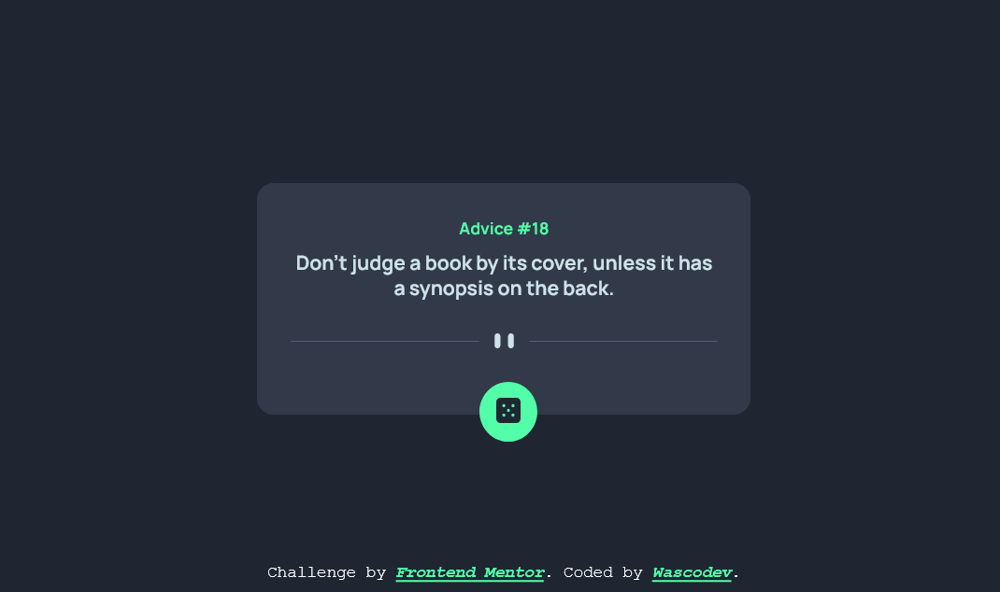
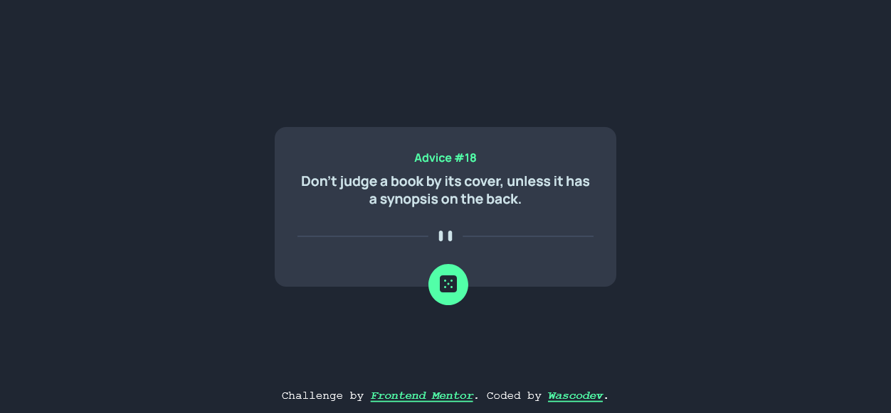
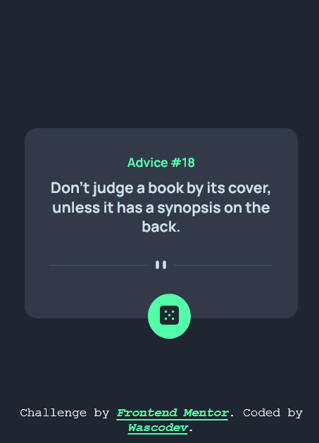
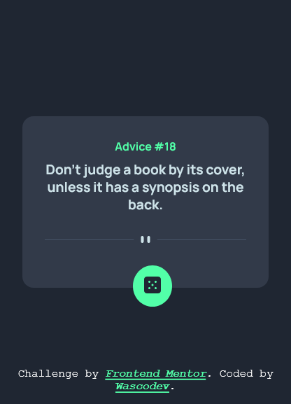

## Table of contents

  - [The challenge](#the-challenge)
  - [Screenshot](#screenshot)
- [My process](#my-process)
  - [Built with](#built-with)
  - [What I learned](#what-i-learned)
  - [Useful resources](#useful-resources)
- [Author](#author)
### The challenge

Users should be able to:

- View the optimal layout for the app depending on their device's screen size
- See hover states for all interactive elements on the page
- Generate a new piece of advice by clicking the dice icon

### Screenshot







### Links

- Solution URL: (https://www.frontendmentor.io/solutions/css-js-html-vsy2pzmGdO)
- Live Site URL: (https://advicequote.vercel.app/)

## My process

### Built with

- Semantic HTML5 markup
- CSS custom properties
- Flexbox

### What I learned

All thanks to Frontend Mentor. I learn a lot of things in this project, most especially i understand the best way to be a clever programmer is challenge your self, give task to your self then know how good you are so that you will be able have coffident in your self. 

```html
<h1>Some HTML code I'm proud of</h1>
```
```css
.proud-of-this-css {
 display:flex-box
 align-items
 justify-content
 transform-translate
 e.t.c

}
```

### Useful resources

- [css color generator](https://cssgenerator.org/box-shadow-css-generator.html) - This helped me for animation  reason. I really liked this pattern and will use it going forward.


## Author

- Website : (https://github.com/WascoDev)
- Frontend Mentor : (https://www.frontendmentor.io/profile/Wasco123)
- Twitter : (https://twitter.com/Wasco_Dev)


